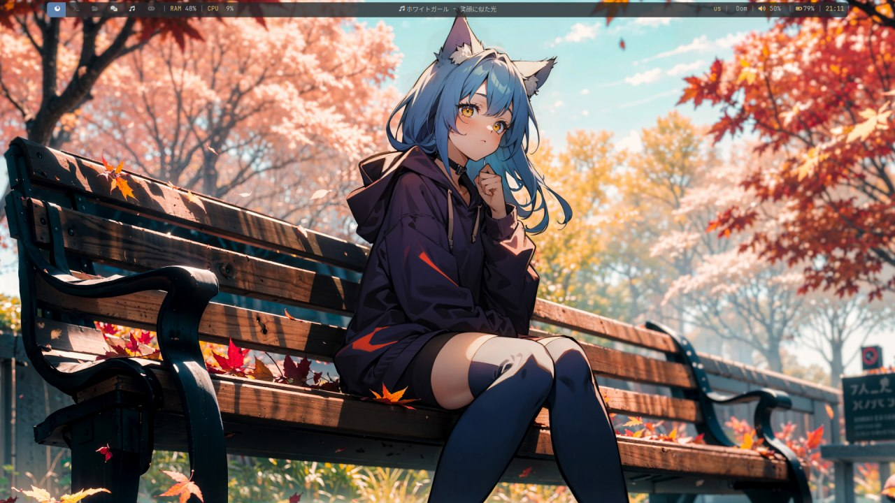
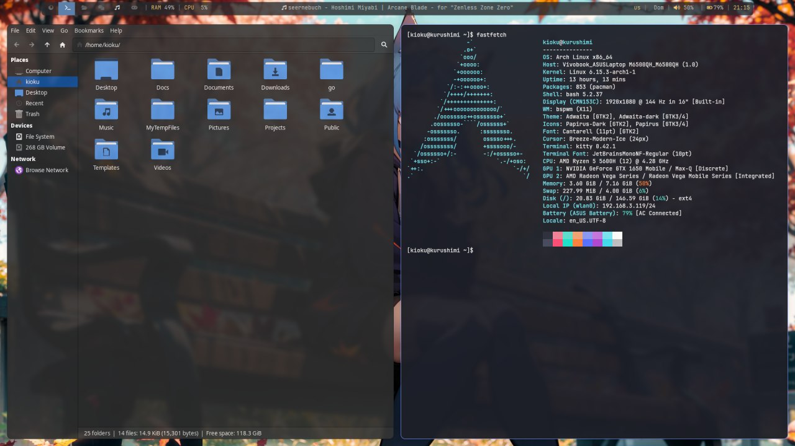
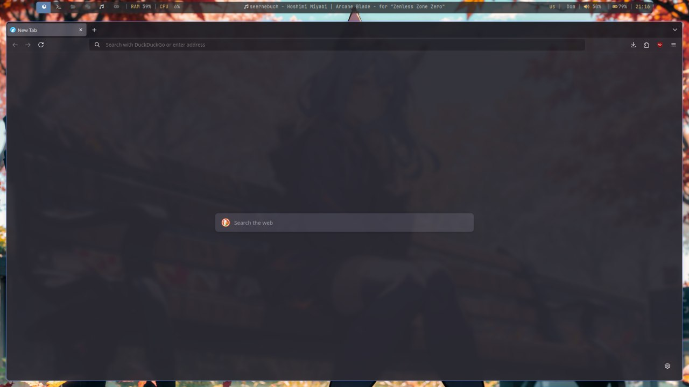

<h1 align="center"> :herb: Hasonako Build :herb: </h1>

<!-- INFORMATION -->
<h1 align="left"> :blue_book: About</h1> 



</br>
This is still a very early version of my rice — I’ve just made the switch to Linux.
And yeah, I chose Arch Linux with BSPWM as my first distro.
This setup is a patchwork of inspiration from all over, with some clear influence from Zproger.
Slowly shaping it into something personal.
(Even this README was put together with some help from his work.)

 - OS: [**`Arch Linux`**](https://archlinux.org/)
 - WM: [**`BSPWM`**](https://github.com/baskerville/bspwm)
 - Bar: [**`Polybar`**](https://github.com/polybar/polybar)
 - Compositor: [**`Picom`**](https://github.com/yshui/picom)
 - Terminal: [**`Kitty`**](https://github.com/kovidgoyal/kitty)
 - App Launcher: [**`Rofi`**](https://github.com/davatorium/rofi)
 - Notify Daemon: [**`Dunst`**](https://github.com/dunst-project/dunst)

</br>

<!-- IMAGES -->
## 🖼️ Gallery




<!-- INSTALLATION -->
## :blue_book: Installation
```bash
git clone https://github.com/hasonako/MaRice
cd MaRice
chmod +x installer.sh
./installer.sh
```
<!-- HOTKEYS -->
## 💻 HotKeys

* **Open the terminal** - `super + enter`
* **Switch the layout** - `shift + alt`
* **Open the application menu** - `super + d`
* **Launch Telegram** - `super + shift + t`
* **Close the window that is in focus** - `super + c`
* **Take a screenshot** - `print`
* **Restart bspwm** - `ctrl + shift + r`
* **Quit bspwm** - `ctrl + shift + q`
* **Switch to another desktop** - `super + 1-6`
* **Move the window to another desktop** - `super + ctrl + left/right`

The other hotkeys are in `~/.config/sxhkd/sxhkdrc`.
